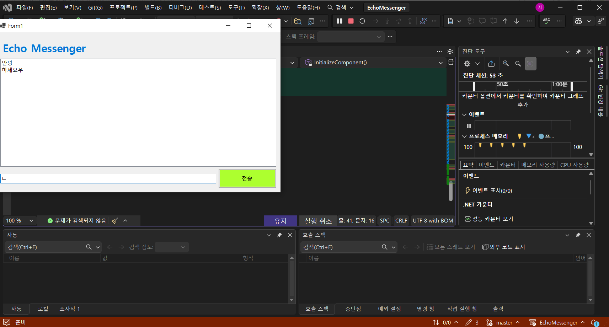
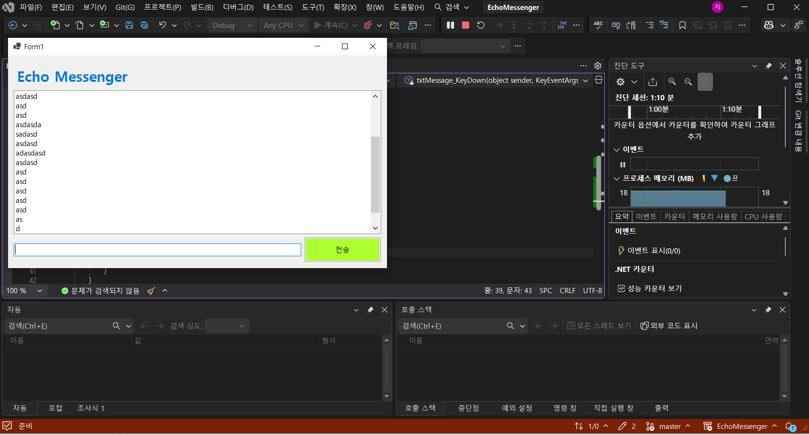
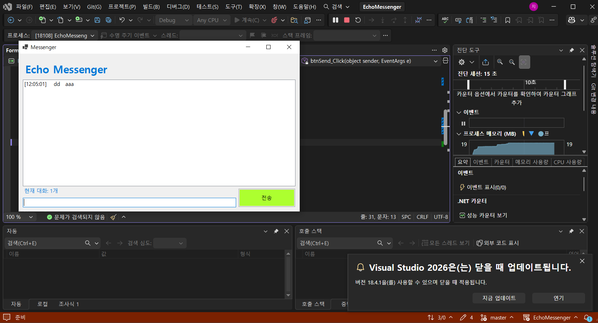
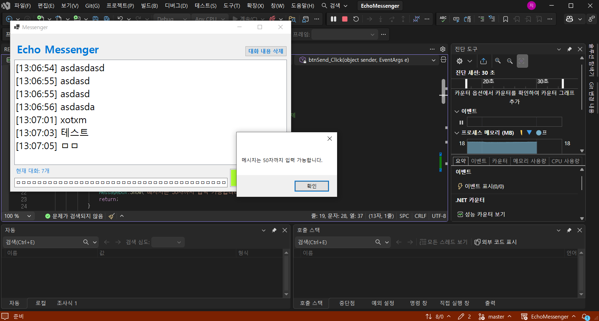

# (C# 코딩) 에코메신저
## 개요-C# 프로그래밍학습
- 1줄소개: 키보드 입력을 받아 출력하는 메신저
- 사용한플랫폼: -C#, .NET Windows Forms, Visual Studio, GitHub
- 사용한컨트롤:-Label, TextBox, ListBox, Button
- 사용한기술과구현한기능:
- Label, TextBox, ListBox, Button를 사용해 UI 디자인
- Items.Add로 ListBox에 TextBox에 받은 string 값 추가
-txtMessage.Focus로 커서가 입력창에 자동으로 누르도록 구현
-if (e.KeyCode == Keys.Enter)로 엔터를 감지해 이벤트 실행
-string.IsNullOrWhiteSpace로 공백음 감지해 공백이 입력되는 것을 방지
- Trim()로 텍스트 앞 공백 제거
- {DateTime.Now:HH:mm:ss} 현재 시간을 받아와 시간,분,초를 두 자리 출력
- Count 속성을 통해 값을 가져와 텍스트 개수 확인
- if (listMessage.SelectedIndex == -1)룰 사용해 선택 안할 때를 지정
- .Items.RemoveAt 로 ListBox에서 특정 항목 제거
- 
## 실행화면(과제1)

-과제 내용
-

- Label(표시), TextBox(입력), Button(전송), ListBox(대화창)를 적절히 배치
- 전송 버튼 클릭시 TextBox의 텍스트를 ListBox의 항목(Items)으로 추가
- 추가 직후 TextBox의 내용을 비워(Clear) 다음 입력을 준비

-구현 내용과 기능 설명
-
- TextBox에 내용을 적고 전송 버튼을 누르면 ListBox에 내용이 출력
- 전송 후에 TextBox의 내용 초기화
## 실행화면(과제2)

-과제 내용
-
- 전송이 끝나면 입력 창에 남겨진 기존 메시지를 삭제
- 전송 후에 마우스로 입력 창을 다시 클릭하지 않아도 되도록 커서를 자동으로 입력창에 위치
- 마우스 클릭 대신 키보드의 Enter 키를 눌러도 메시지가 전송
- 내용이 없는 빈문자열이나 공백(Space)만 있을 때는 메시지가 전송되지 않도록 방지

-구현 내용과 기능 설명
-
- 전송 후에 커서가 입력창에 위치함
- 키보드의 Enter키를 눌러도 전송함
- 입력창에 공백을 입력하면 전송하지 않음

## 실행화면(과제3)
(img/3주차 과제3-2.png)
-공백 제거 전/후 비교 스크린샷

-과제 내용
-
- 메시지 앞에 현재 시간을 자동으로 결합하여 리스트에 출력
- 현재 리스트에 쌓인 총 메시지 개수를 계산하여 하단Label에 실시간으로 업데이트
- 사용자가 입력한 메시지의 앞뒤 불필요한 공백을 Trim() 함수로 제거하여 저장

-구현 내용과 기능 설명
-
- ListBox에 전송한 메세지 수 표시
- 현재 시간과 Text를 합쳐서 저장 후 출력함
- Trim()로 텍스트 앞 공백 제거

## 실행화면(과제4)
(img/3주차 과제4-2.png)(img/3주차 과제4-3.png)

-과제 내용
-
- ListBox에서 특정메시지를 마우스로 클릭하고 '삭제' 버튼을 누르면 해당항목만 목록에서 제거 (단, 선택하지않고 삭제시 발생하는 에러를 예외처리)
- '대화 기록 삭제' 버튼을 클릭하면 리스트의 모든 내용을 한번에 지움
- 입력창에 글자 수를 50자로 제한하고, 초과 시 사용자에게 경고 메시지를 띄우거나 전송을 차단
- 
-구현 내용과 기능 설명
-
- 입력한 내용이 50자 이상일시 경고 메시지 출력
- 리스트 화면을 마우스 클릭시 해당 메세지 삭제
- '대화 기록 삭제' 버튼 클릭시 리스트의 모든 내용 제거